**MVP - Engenharia de dados - PUC RJ**  
**Nome:** Luis Carlos Firmino Pinheiro  
**Matrícula:** 4052026000838  
**Data:** 09/2026

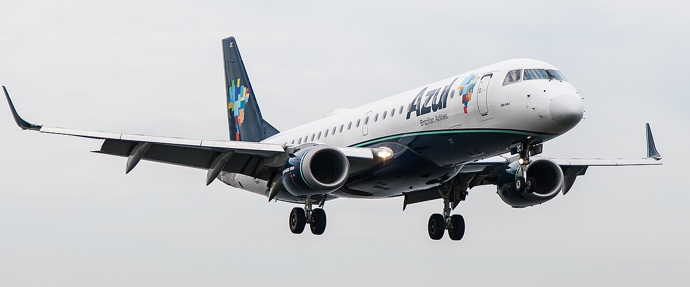

# Dados de Pontualidade de Viagens Aéreas no Brasil

## Sumário
- [1. Contexto de Negócios e Perguntas](#1-contexto-de-negócios-e-perguntas)
- [2. Carga dos Dados](#2-carga-dos-dados)
- [3. Modelagem e Catálogo de Dados](#3-modelagem-e-catálogo-de-dados)
- [4. Pipeline de Dados](#4-pipeline-de-dados)
- [5. Qualidade de Dados](#5-qualidade-de-dados)
- [6. Análise de Dados](#6-análise-de-dados)
- [7. Autoavaliação](#7-autoavaliação)

## 1. Contexto de Negócios e Perguntas

### 1.1 Objetivo:

O objetivo deste trabalho é utilizar dados disponíveis publicamente para entender o panorama de operações aéreas no território nacional, especificamente sobre a pontualidade dessas operações, limitando-se a rotas domésticas (sendo a companhia nacional ou não), e apenas de transporte de passageiros.  
O período será limitado de Janeiro de 2023 até Julho de 2026 (último mês disponível).

### 1.2 Perguntas de Negócio:

Para esse projeto teremos como objetivo principal algumas perguntas:

*OBS: Índice de pontualidade (I.P.): `Número de Voos pontuais na [etapa] / Número total de voos Realizados`*

1. **Qual o I.P. de partida e chegada, por companhia, em todo o período? Como cada uma se compara à média geral?** 
1. **Qual o I.P. de partida e chegada, por companhia, ano a ano (incluindo o ano incompleto de 2026)? Existe alguma piora ou melhora nesses índices?**
1. **Qual o I.P. de partida e chegada por Rota? Quais são as 10 melhores e 10 piores?**
1. **Qual o I.P de partida e chegada por Aeroporto? Quais são os 10 melhores e os 10 piores?**
1. **Como é o I.P de partida e chegada por mês? Existe algum ciclo ou sazonalidade?**
1. **Como é o I.P de partida e chegada por dia da semana? Existe alguma tendência?**
1. **Como é o I.P de partida e chegada por horário de partida do voo? Horários com mais partidas ou chegadas têm mais atrasos?**
1. **Qual é a média de tempo de atraso de partida e de chegada, por Companhia?**
1. **Qual é a média de tempo de atraso de partida e de chegada, por Rota?**
1. **Qual é a média de tempo de atraso de partida e de chegada, por Aeroporto?**

Algumas definições prévias:
- Só serão considerados voos realizados.
- O ranking (10 melhores, 10 piores) terá um piso mínimo de dados definido por cálculo estatístico, considerando nível de confiança e margem de erro estabelecidos para cada indicador.
- A pontualidade é definida pela própria ANAC e é explícita em dois campos `Situação Partida` e `Situação Chegada`. Não será feito nenhum cálculo arbitrário para definir por meio de tempo de atraso, usaremos apenas a fonte oficial.

### 1.3 Contexto dos dados
Usaremos como fonte de dados o [portal de dados abertos da ANAC](https://dados.gov.br/dados/organizacoes/visualizar/agencia-nacional-de-aviacao-civil-anac).

Abaixo a lista de conjuntos de dados utilizados:  

**Nome do Conjunto:**  Voos e operações aéreas - Voo Regular Ativo (VRA)  
**Link para o conjunto:** https://dados.gov.br/dados/conjuntos-dados/dadosabertos-areas-de-atuacao-voos-e-operacoes-aereas-voo-regular-ativo-vra  
**Descrição do Conjunto:** O Voo Regular Ativo – VRA é uma base de dados composta por informações de voos de empresas de transporte aéreo regular que apresenta alterações de voos (atrasos, antecipações e cancelamentos), horários em que os voos ocorreram e as justificativas apresentadas pelas empresas aéreas para tais alterações. Por meio desta base de dados, podem ser obtidos os índices de pontualidade, regularidade e de desempenho operacional além dos percentuais de atrasos e cancelamentos. O mês publicado se refere às etapas cujas decolagens eram previstas para o mês em questão ou cujas decolagens, em caso de etapa não prevista, foram realizadas no mês em questão.  
**Licença:** Creative Commons Attribution (CC-BY)  
**Metadados Oficiais:** https://www.gov.br/anac/pt-br/acesso-a-informacao/dados-abertos/areas-de-atuacao/voos-e-operacoes-aereas/voo-regular-ativo-vra/62-voo-regular-ativo-vra

**Nome do Conjunto:**  Operador aéreo - Empresas aéreas   
**Link para o conjunto:** https://dados.gov.br/dados/conjuntos-dados/operador-aereo---empresas-aereas  
**Descrição do Conjunto:** Informações do Cadastro de empresas aéreas aptas a operar no Brasil.  
**Licença:** Creative Commons Attribution (CC-BY)  
**Metadados Oficiais:** https://www.gov.br/anac/pt-br/acesso-a-informacao/dados-abertos/areas-de-atuacao/operador-aereo/empresas-aereas/metadados-operador-aereo-empresas-aereas

**Nome do Conjunto:**   Aeródromos - Lista de Aeródromos Públicos V2     
**Link para o conjunto:** https://dados.gov.br/dados/conjuntos-dados/aerodromos---lista-de-aerodromos-publicos-v2    
**Descrição do Conjunto:** ​​Dados cadastrais de aeródromos privados, que são aqueles aeródromos abertos ao tráfego aéreo de uso privativo. [^1]   
**Licença:** Creative Commons Attribution (CC-BY)  
**Metadados Oficiais:** https://www.gov.br/anac/pt-br/acesso-a-informacao/dados-abertos/areas-de-atuacao/aerodromos/aerodromos-publicos/lista-de-aerodromos-publicos/metadados-do-conjunto-de-dados-lista-de-aerodromos-publicos-v2  

[^1] Nota: a descrição desse conjunto está inconsistente com o título, mas foi mantida conforme está disponível na fonte oficial.

### 1.4 Resumo da Estrutura de Dados Brutos

**VRA**  
Essa será nossa tabela fato, com os dados por viagem

| Campo | Descrição |
| --- | --- |
|Sigla ICAO Empresa Aérea | Sigla/Designador ICAO Empresa Aérea |
|Empresa Aérea | Nome da empresa aérea |
|Número Voo | Numeração do voo |
|Código DI | Caractere usado para identificar o Dígito Identificador (DI) para cada etapa de voo |
|Código Tipo Linha | Caractere usado para identificar o Tipo de Linha realizada para cada etapa de voo |
|Modelo Equipamento | Modelo do equipamento utilizado no voo no padrão ICAO |
|Número de Assentos | Quantidade de assentos da aeronave |
|Sigla ICAO Aeroporto Origem | Sigla/Designador ICAO Aeroporto de Origem |
|Descrição Aeroporto Origem | Nome do aeroporto, cidade, estado e país no qual é localizado |
|Sigla ICAO Aeroporto Destino | Sigla/Designador ICAO Aeroporto de Destino |
|Descrição Aeroporto Destino | Nome do aeroporto, cidade, estado e país no qual é localizado |
|Partida Prevista | Data e horário da partida prevista informada pela empresa aérea, em horário de Brasília |
|Partida Real | Data e horário da partida realizada informada pela empresa aérea, em horário de Brasília |
|Chegada Prevista | Data e horário da chegada prevista informada pela empresa aérea, em horário de Brasília |
|Chegada Real | Data e horário da chegada realizada, informada pela empresa aérea, em horário de Brasília |
|Situação do voo | Campo informando a situação do voo: realizado, cancelado ou não informado. |
|Justificativa | Este campo deixou de ser exigido a partir de abril de 2020, com a revogação da Instrução de Aviação Civil (IAC) 1504. |
|Situação Partida | Campo informando a situação do voo na partida: Antecipado, Pontual, Atraso 30-60, Atraso 60-120, Atraso 120-240, Atraso > 240. |
|Situação Chegada | Campo informando a situação do voo na chegada: Antecipado, Pontual, Atraso 30-60, Atraso 60-120, Atraso 120-240, Atraso > 240. |

**Empresas Aéreas**  
Tabela dimensão com as informações das companhias aéreas.

| Campo | Descrição |
| --- | --- |
| ICAO | Designador de 3 letras fornecidos pela Organização de Aviação Civil Internacional (OACI) às empresas aéreas. Ressalta-se que as regras para alocação e manutenção dos designadores são realizados pela OACI, no DOC 8585. Esta Gerência Técnica de Outorgas de Serviços Aéreos – GTOS disponibiliza os dados fornecidos pelas empresas aéreas.|
| id_empresa_aerea | Empresas, nacionais ou internacionais, que exploram serviços aéreos públicos mediante prévia concessão ou autorização, conforme disciplinado pelo art.180 da Lei nº 7565, de 19 de dezembro de 1986, que dispõe sobre o Código Brasileiro de Aeronáutica. |
| Razão Social| Nome de registro da empresa constante em seu ato constitutivo. | 
| CNPJ | Cadastro Nacional de Pessoa Jurídica mantido pela RFB. |
| Atividades Aéreas | Atividades desempenhadas por empresas aéreas mediante remuneração, que abrange o disposto no art. 175 da Lei nº 7565, de 19 de dezembro de 1986, que dispõe sobre o Código Brasileiro de Aeronáutica. São exemplos de atividades aéreas o transporte aéreo regular, transporte aéreo não-regular e serviços aéreos especializados.|
| Endereço Sede | Endereço da sede que consta no Contrato ou Estatuto Social da empresa aérea. |
| Cidade | Cidade em que a empresa aérea está sediada. |
| UF | UF em que a empresa aérea está sediada. |
| CEP | CEP em que a empresa aérea está sediada. |
| Telefone | Contato telefônico da empresa aérea. |
| E-Mail | Correio eletrônico da empresa aérea. |
| Decisão Operacional | Instrumento legal que autoriza, mediante autorização ou concessão, a exploração dos serviços aéreos públicos. |
| Data Decisão Operacional | Data em que a Decisão Operacional é publicada no Diário Oficial da União. |
| Validade Operacional | Data de expiração da decisão operacional |

**Aeródromos**  
Tabela dimensão com as informações dos aeroportos.

| Campo | Descrição |
| --- | --- |
| Código OACI | Código de 4 letras utilizado internacionalmente para identificação de um aeródromo, conforme regras da Organização de Aviação Civil Internacional (OACI). No Brasil, são utilizados os códigos que iniciam com as letras SB, SD, SI, SJ, SN, SS e SW. |
| CIAD | O Código de Identificação do Aeródromo se trata de um identificador único de aeródromos civis, e é formado pela junção de dois caracteres e quatro dígitos, sendo que os caracteres são referentes à unidade da federação onde o aeródromo se localiza e os dígitos são atribuídos de forma sequencial (formato UF0000). |
| Nome | Denominação do aeródromo. |
| Município | Município onde se localiza o aeródromo, considerando as coordenadas de referência do mesmo. |
| UF | Unidade da federação do município onde se localiza o aeródromo. |
| Município Servido | Município principal servido pelo aeródromo. |
| UF Servido | Unidade da federação do município servido. |
| LATGEOPOINT | Latitude do ponto de referência do aeródromo. A coordenada geográfica é fornecida em decimais [^2]|
| LONGEOPOINT | Longitude do ponto de referência do aeródromo. A coordenada geográfica é fornecida em decimais |
| Latitude | Latitude do ponto de referência do aeródromo. A coordenada geográfica é fornecida em graus, minutos e segundos, o sistema de referência é WGS-84. |
| Longitude | Longitude do ponto de referência do aeródromo. A coordenada geográfica é fornecida em graus, minutos e segundos, o sistema de referência é WGS-84. |
| Altitude | Altitude do ponto de referência mais elevado na área de pouso, em metros. |
| Operação Diurna | Tipo de operação do período diurno para o qual o aeródromo está habilitado, considerando as regras de voo (VFR – Visual, IFR – Instrumento). |
| Operação Noturna | Tipo de operação do período noturno para o qual o aeródromo está habilitado, considerando as regras de voo (VFR – Visual, IFR – Instrumento). |
| Situação | Indicação de eventual medida administrativa aplicada pela ANAC ao aeródromo, em geral constituindo-se em algum tipo de restrição operacional. |
| Validade do Registro | Data de validade do cadastro do aeródromo, que pode ser renovada mediante requerimento prévio, desde que estejam mantidas as condições técnicas para as quais o aeródromo foi aberto ao tráfego aéreo. |
| Portaria de Registro | Número e ano da última Portaria de cadastro do aeródromo dentro da validade, ou seja, o ato que dá regularidade cadastral à infraestrutura. A Portaria é indicada no formato PAxxxx-yyyy, onde PA representa Portaria ANAC, xxxx é o ano de publicação e yyyy é o número da Portaria. Assim, por exemplo a indicação PA2020-0001 representa uma Portaria ANAC número 0001 do ano 2020. |
| Link Portaria | Link para acesso direto ao arquivo .pdf da portaria de cadastro do aeródromo. |

Além desses metadados a ANAC disponibiliza um dicionário de variáveis e regras:  
https://www.gov.br/anac/pt-br/assuntos/regulados/empresas-aereas/Instrucoes-para-a-elaboracao-e-apresentacao-das-demonstracoes-contabeis/descricao-de-variaveis

[^2] Nota: LATGEOPOINT e LONGEOPOINT não são mencionados na documentação oficial, mas estão presentes no arquivo csv, seu conteúdo foi inferido a partir dos dados.

## 2. Carga dos Dados

As etapas dessa fase e os detalhes de implementação podem ser encontrados nos seguintes notebooks:

1. [01-preparacao-ambiente](notebooks/01-preparacao-ambiente.ipynb)
1. [02-carga-dados-brutos](notebooks/02-carga-dados-brutos.ipynb)

Em resumo, foi criado um catálogo com schemas staging, bronze, silver e gold além de um volume de arquivos no schema staging. Isso foi realizado diretamente por código disponível no notebook 01.

> Catálogo com os schemas staging, bronze, silver e gold

A partir daí os dados foram consultados diretamente nas suas fontes online, utilizando requisições no código, usando a biblioteca `requests`, e salvos no Volume do schema staging.

Os arquivos VRA foram salvos em uma subpasta, cada um em formato .csv e seu nome original. O arquivo de aeródromos foi salvo na raiz do volume também como csv. Já o arquivo de empresas foi salvo como .json. Mantivemos a extensão original de cada arquivo.

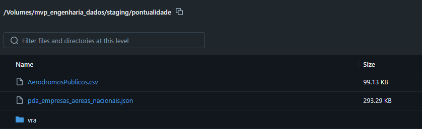

> Estrutura do Schema Staging

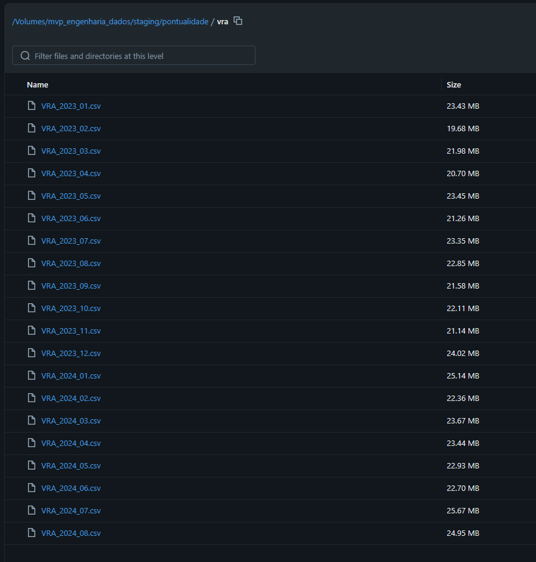

> Subpasta com os arquivos VRA

**Nessa etapa nenhum dado foi modificado, apenas salvo como se encontram em suas fontes originais.**

## 3. Modelagem e Catálogo de Dados

### 3.1 Modelagem

Foi utilizada uma arquitetura Medalhão (Medallion), com camadas Bronze, Silver e Gold, com Star Schema.

1. Na [Bronze](notebooks/03-camada-bronze.ipynb), os dados foram carregados em sua forma crua, sem tratamentos
1. Na [Silver](notebooks/04-camada-silver.ipynb), ficou a maior parte dos tratamentos dos dados e aplicação das regras de negócio.
1. Na [Gold](notebooks/05-camada-gold), foram criadas as chaves primárias e estrangeiras das tabelas, definidas as tabelas fato e dimensão do star schema.

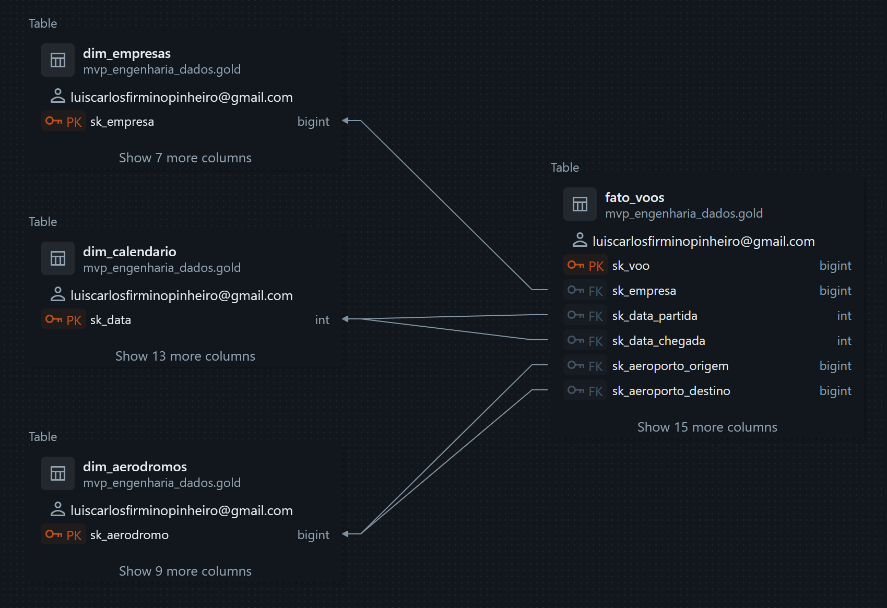
> Diagrama da Camada Gold Final

### 3.2 Catálogo de dados

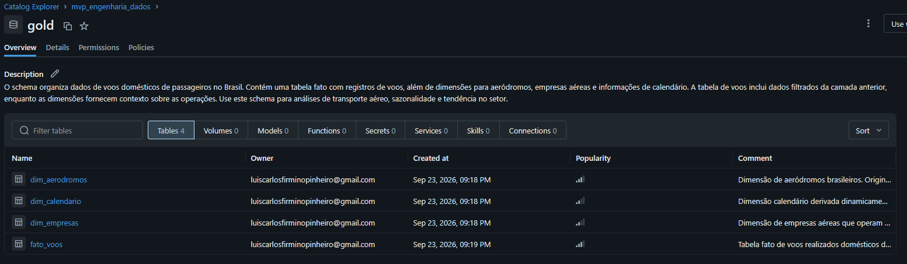 

| Tabela | Tipo | Registros | Descrição |
| --- | --- | --- | --- |
| `gold.dim_empresas` | Dimensão | 16 | Empresas aéreas que operam voos domésticos no Brasil. Originada da `silver_empresas` (fonte ANAC: Operador aéreo - Empresas aéreas), complementada manualmente com PTB (Voepass) e PAM (MAP) e com remoção de empresas exclusivamente de carga no notebook 04-camada-silver |
| `gold.dim_aerodromos` | Dimensão | 504 | Aeródromos brasileiros. Originada da `silver_aerodromos` (fonte ANAC: Aeródromos Públicos V2 + SIROS), com complementação de 28 códigos do SIROS, padronização de UF e remoção de aeródromos estrangeiros no notebook 04-camada-silver |
| `gold.dim_calendario` | Dimensão | 1.339 | Calendário derivado dinamicamente do range de datas (jan/2023 a jul/2026) da `silver_vra`. Contém ano, mês, dia da semana, trimestre, semana e flags de fim de semana/dia útil |
| `gold.fato_voos` | Fato | 2.732.331 | Tabela fato de voos domésticos de passageiros realizados. Originada da `silver_vra` (fonte ANAC: VRA), com INNER JOIN para `dim_empresas`, `dim_aerodromos` (origem/destino) e `dim_calendario` (partida/chegada). Cobertura de 100% dos registros da silver |

#### Constraints (PK e FK)

| Tabela | Constraint | Tipo | Coluna(s) |
| --- | --- | --- | --- |
| `dim_empresas` | `pk_dim_empresas` | PRIMARY KEY | `sk_empresa` |
| `dim_aerodromos` | `pk_dim_aerodromos` | PRIMARY KEY | `sk_aerodromo` |
| `dim_calendario` | `pk_dim_calendario` | PRIMARY KEY | `sk_data` |
| `fato_voos` | `pk_fato_voos` | PRIMARY KEY | `sk_voo` |
| `fato_voos` | `fk_fato_empresa` | FOREIGN KEY | `sk_empresa` → `dim_empresas.sk_empresa` |
| `fato_voos` | `fk_fato_aeroporto_origem` | FOREIGN KEY | `sk_aeroporto_origem` → `dim_aerodromos.sk_aerodromo` |
| `fato_voos` | `fk_fato_aeroporto_destino` | FOREIGN KEY | `sk_aeroporto_destino` → `dim_aerodromos.sk_aerodromo` |
| `fato_voos` | `fk_fato_data_partida` | FOREIGN KEY | `sk_data_partida` → `dim_calendario.sk_data` |
| `fato_voos` | `fk_fato_data_chegada` | FOREIGN KEY | `sk_data_chegada` → `dim_calendario.sk_data` |

#### `dim_empresas` - Dimensão de empresas aéreas (16 registros, 8 colunas)

| Coluna | Tipo | Descrição |
| --- | --- | --- |
| `sk_empresa` | bigint | Surrogate key da empresa (PK). Gerada por `monotonically_increasing_id` na gold |
| `sigla_icao_empresa` | string | Designador ICAO de 3 letras da empresa aérea (chave natural). Origem: campo `icao` da `silver_empresas` (fonte ANAC: Empresas Aéreas). Valores: GLO, AZU, TAM, PTB, PAM, SID, OMI, PLS, AEB, ABJ, CQB, ACN, etc. |
| `empresa` | string | Nome curto no formato PRIMEIRA_PALAVRA (ICAO), ex: GOL (GLO), AZUL (AZU), TAM (TAM). Origem: campo `empresa` da `silver_empresas` |
| `razao` | string | Razão social da empresa aérea. Origem: campo `razao` da `silver_empresas` (fonte ANAC) |
| `cidade` | string | Cidade onde a empresa é sediada. Origem: campo `cidade` da `silver_empresas` |
| `uf` | string | Unidade da Federação da sede da empresa. Valores: siglas de UF brasileiras (SP, RJ, GO, etc.) |
| `ativa` | string | Status da empresa no cadastro da ANAC. Domínio: ATIVA, INATIVA |
| `estrangeira` | string | Código designador internacional da empresa (ex: WD, 2S, TT). Valor "-" quando a empresa não possui designador internacional |

#### `dim_aerodromos` - Dimensão de aeródromos (504 registros, 10 colunas)

| Coluna | Tipo | Descrição |
| --- | --- | --- |
| `sk_aerodromo` | bigint | Surrogate key do aeródromo (PK). Gerada por `monotonically_increasing_id` na gold |
| `sigla_icao_aeroporto` | string | Código OACI de 4 letras do aeródromo (chave natural). Origem: campo `codigo_oaci` da `silver_aerodromos` (fonte ANAC + SIROS). Prefixos brasileiros: SB, SD, SI, SJ, SN, SS, SW |
| `aerodromo` | string | Nome do aeródromo no formato NOME (CODIGO_OACI), ex: GUARULHOS (SBGR). Origem: campo `aerodromo` da `silver_aerodromos` |
| `nome` | string | Denominação oficial do aeródromo. Origem: campo `nome` da `silver_aerodromos` (fonte ANAC + SIROS) |
| `municipio` | string | Município onde se localiza o aeródromo. Origem: campo `municipio` da `silver_aerodromos`, com coalesce entre Município e Município Servido |
| `uf` | string | Unidade da Federação do município do aeródromo. Domínio: nomes por extenso de UF brasileiras (SÃO PAULO, RIO DE JANEIRO, AMAZONAS, etc.). Padronizado de códigos de 2 letras do SIROS |
| `latgeopoint` | double | Latitude do ponto de referência em graus decimais (WGS-84). Faixa: -93,0 a +5,0 (território nacional) |
| `longeopoint` | double | Longitude do ponto de referência em graus decimais (WGS-84). Faixa: -74,0 a -34,0 (território nacional) |
| `altitude` | double | Altitude do ponto mais elevado na área de pouso, em metros. Faixa: 0 a ~3.000 m. Convertido de vírgula para ponto decimal na silver |
| `situacao` | string | Situação cadastral do aeródromo. Domínio: CADASTRADO, INTERDITADO |

#### `dim_calendario` - Dimensão de tempo (1.339 registros, 14 colunas)

| Coluna | Tipo | Descrição |
| --- | --- | --- |
| `data` | date | Data (tipo date) |
| `sk_data` | int | Surrogate key da data no formato yyyyMMdd (PK), ex: 20230101. Gerada a partir do campo `data` |
| `ano` | int | Ano da data |
| `mes` | int | Número do mês (1 a 12) |
| `nome_mes` | string | Nome do mês em português (Janeiro, Fevereiro, etc.) |
| `ano_mes` | string | Ano e mês no formato yyyy-MM (ex: 2023-01) |
| `dia` | int | Dia do mês (1 a 31) |
| `dia_semana` | int | Número do dia da semana (1=Domingo, 7=Sábado) |
| `nome_dia_semana` | string | Nome do dia da semana em português |
| `trimestre` | int | Trimestre (1 a 4) |
| `nome_trimestre` | string | Rótulo no formato T# AAAA (ex: T1 2023) |
| `semana_ano` | int | Número da semana no ano (ISO). Faixa: 1 a 53 |
| `fim_de_semana` | boolean | TRUE se sábado ou domingo |
| `dia_util` | boolean | TRUE se segunda a sexta |

#### `fato_voos` - Tabela fato de voos (2.732.331 registros, 21 colunas)

| Coluna | Tipo | Descrição |
| --- | --- | --- |
| `sk_voo` | bigint | Surrogate key do voo (PK). Gerada por `monotonically_increasing_id` na gold |
| `sk_empresa` | bigint | FK para `dim_empresas.sk_empresa`. Origem: INNER JOIN com `dim_empresas` via `sigla_icao_empresa` |
| `sk_data_partida` | int | FK para `dim_calendario.sk_data` (data da partida). Derivada de `partida_real` |
| `sk_data_chegada` | int | FK para `dim_calendario.sk_data` (data da chegada). Derivada de `chegada_real` |
| `sk_aeroporto_origem` | bigint | FK para `dim_aerodromos.sk_aerodromo` (aeroporto de origem). Origem: INNER JOIN com `dim_aerodromos` via `sigla_icao_aeroporto_origem` |
| `sk_aeroporto_destino` | bigint | FK para `dim_aerodromos.sk_aerodromo` (aeroporto de destino). Origem: INNER JOIN com `dim_aerodromos` via `sigla_icao_aeroporto_destino` |
| `numero_voo` | string | Numeração do voo atribuída pela empresa. Origem: campo `numero_voo` da `silver_vra` (fonte ANAC: VRA) |
| `modelo_equipamento` | string | Modelo do equipamento utilizado no voo no padrão ICAO (ex: B738, A320, E190). Origem: campo `modelo_equipamento` da `silver_vra` |
| `numero_de_assentos` | int | Quantidade de assentos da aeronave. Faixa: 1 a ~500 (voos de passageiros; voos com 0 assentos foram removidos como carga). Origem: `silver_vra` |
| `partida_prevista` | timestamp | Data e horário previstos para a decolagem (horário de Brasília). Origem: campo `partida_prevista` da `silver_vra` (fonte ANAC: VRA) |
| `partida_real` | timestamp | Data e horário reais da decolagem (horário de Brasília). Origem: campo `partida_real` da `silver_vra`. 660 registros com deslocamento de 1 dia foram corrigidos |
| `chegada_prevista` | timestamp | Data e horário previstos para o pouso (horário de Brasília). Origem: campo `chegada_prevista` da `silver_vra` (fonte ANAC: VRA) |
| `chegada_real` | timestamp | Data e horário reais do pouso (horário de Brasília). Origem: campo `chegada_real` da `silver_vra`. 665 registros com deslocamento de 1 dia foram corrigidos |
| `situacao_partida` | string | Situação do voo na partida. Domínio: Antecipado, Pontual, Atraso 30-60, Atraso 60-120, Atraso 120-240, Atraso > 240. Origem: campo `situacao_partida` da `silver_vra` (fonte ANAC) |
| `situacao_chegada` | string | Situação do voo na chegada. Domínio: Antecipado, Pontual, Atraso 30-60, Atraso 60-120, Atraso 120-240, Atraso > 240. Origem: campo `situacao_chegada` da `silver_vra` (fonte ANAC) |
| `pontual_partida` | boolean | TRUE quando `situacao_partida` é Antecipado ou Pontual (voo não atrasou na partida). Derivado na gold |
| `pontual_chegada` | boolean | TRUE quando `situacao_chegada` é Antecipado ou Pontual (voo não atrasou na chegada). Derivado na gold |
| `atraso_partida_min` | double | Atraso na partida em minutos (valor negativo indica adiantamento). Faixa: ~-60 a +1439 min (atrasos extremos >1440 min foram removidos na silver). Derivado de `partida_real - partida_prevista` |
| `atraso_chegada_min` | double | Atraso na chegada em minutos (valor negativo indica adiantamento). Faixa: ~-60 a +1439 min (atrasos extremos >1440 min foram removidos na silver). Derivado de `chegada_real - chegada_prevista` |
| `descricao_etapa` | string | Descrição da etapa do voo. Domínio: Etapa Regular, Etapa de Voo Charter, Etapa de Voo de Fretamento, Etapa de Voo de Tripulação, etc. Origem: campo `descricao_etapa` da `silver_vra` |
| `referencia` | date | Mês de referência da publicação ANAC (período ao qual as decolagens previstas/realizadas pertencem). Origem: campo `referencia` da `silver_vra` |

## 4. Pipeline de Dados

A linhagem de tratamentos segue a seguinte sequência:

1. [01-preparacao-ambiente](notebooks/01-preparacao-ambiente.ipynb)  
Organizamos o workspace do Databricks nas camadas que serão necessárias:   
`staging` → `bronze` → `silver` → `gold` 

1. [02-carga-dados-brutos](notebooks/02-carga-dados-brutos.ipynb)  
 Consultamos as fontes de dados na internet e salvamos no volume em `staging`, mantendo seu formato original em `.csv` e `.json`

1. [03-camada-bronze](notebooks/03-camada-bronze.ipynb)   
Carregamos os dados do volume em `staging` para tabelas delta no unity catalog. Nessa etapa ainda não ocorre nenhum tratamento dos dados, eles são deixados conforme encontrados na origem.
Além disso são incluídos comentários nas tabelas do schema.

1. [04-camada-silver](notebooks/04-camada-silver.ipynb)  
Aqui ocorrem os principais tratamentos dos dados e aplicação das regras de negócio.  
Tratamento de nulos, duplicidades, padronizações de campos de texto, imputação de dados faltantes, verificação de joins entre as tabelas, verificações de intervalos válidos de dados, e filtragem para atender especificamente o objetivo de análise de linhas apenas domésticas e de passageiros.  
Também são incluídos comentários nos campos das tabelas.

1. [05-camada-gold](notebooks/05-camada-gold.ipynb)  
Nessa etapa são definidas as nossas tabelas fato e dimensão, com a adição da tabela `dim_calendario` que é gerada dinamicamente a partir do intervalo de datas da `fato_voos`. 
A partir dos campos identificadores das tabelas dimensão foram geradas Surrogate Keys (SK).  
Também são definidas chaves principais (PK), chaves estrangeiras (FK) para oficializar os relacionamentos do modelo.

1. [06-perguntas-negocio](notebooks/06-perguntas-negocio.ipynb)   
Por fim, executamos consultas SQL nos dados da camada Gold, com a finalidade de responder as perguntas que foram definidas no início do projeto.

## 5. Qualidade de Dados

No notebook [04-camada-silver](notebooks/04-camada-silver.ipynb), os dados foram investigados e tratados ao mesmo tempo. A base original de 3.565.162 registros na camada bronze foi reduzida para 2.732.331 na silver, com perda de 832.831 registros (23,36%). As perdas se dividem em duas categorias:

### 5.1 Filtros de Qualidade de Dados (250.377 registros, 7,0%)

Registros removidos por problemas na própria fonte ANAC:

| Problema | Registros | Descrição |
| --- | --- | --- |
| Duplicatas | 18 | Linhas exatamente iguais na bronze_vra |
| Nulos em Código Tipo Linha | 464 | Sem identificação de tipo de linha (doméstica/internacional) |
| Nulos em datas previstas | 110.760 | Voos sem partida_prevista ou chegada_prevista (impossibilita cálculo de atraso) |
| Nulos em datas reais | 139.002 | Voos sem partida_real ou chegada_real (cancelados ou não realizados) |
| Atrasos extremos | 133 | Registros com atraso > 1440 min (mais de 1 dia), indicando erro de digitação de data na fonte |

### 5.2 Filtros de Regra de Negócio (582.454 registros, 16,3%)

Registros removidos por escopo do projeto (apenas voos domésticos de passageiros):

| Filtro | Registros | Descrição |
| --- | --- | --- |
| Voos não domésticos | 578.059 | Código Tipo Linha != 'N' (voos internacionais e outros) |
| Voos de carga | 4.350 | numero_de_assentos = 0 + 5 empresas exclusivamente de carga removidas da dimensão |
| Voos estrangeiros/ARN | 45 | 44 voos com aeroportos fora do Brasil (erro de classificação ANAC) + 1 registro com empresa inexistente |

### 5.3 Correções sem Perda de Registros

Os seguintes tratamentos foram aplicados sem remover registros:

- **Deslocamento de -1 dia ou +1 dia (1.325 registros):** 660 partidas e 665 chegadas com atraso de 12h-24h tinham o horário correto, mas a data registrada no dia errado. A data foi corrigida em 1 dia, e o atraso, situação e datas reais foram recalculados.
- **Complementação de empresas (PTB e PAM):** As empresas Voepass (PTB) e MAP (PAM) não constavam no cadastro do SIROS. Foram identificadas e inseridas manualmente, recuperando ~38.778 registros que ficavam de fora do INNER JOIN.
- **Complementação de aeródromos (SIROS):** 28 códigos OACI referenciados pela VRA não existiam na dimensão de aeródromos. Foram baixados do SIROS e incorporados, recuperando ~11.840 registros.
- **Tratamento de nulos em aeródromos:** Município/UF preenchidos com Município Servido/UF Servido e vice-versa via coalesce.
- **Padronização de UF SIROS:** Aeródromos incorporados do SIROS usavam códigos de 2 letras (SP, RJ, BA), corrigidos para nome por extenso (SÃO PAULO, RIO DE JANEIRO, BAHIA).
- **Correção de vírgula decimal:** Campo altitude convertido de vírgula para ponto decimal.

### 5.4 Integridade Referencial

Após todos os tratamentos, a silver_vra atingiu 100% de cobertura no INNER JOIN com as dimensões silver_empresas (16 empresas) e silver_aerodromos (504 aeródromos). Antes das complementações de PTB/PAM e SIROS, a perda era de 1,75%.

## 6. Análise de Dados

Agora passamos ao momento de responder as perguntas que foram feitas no início.  
Todas essas perguntas foram respondidas através de consultas **SQL** disponíveis em [06-perguntas-negocio.ipynb](notebooks/06-perguntas-negocio.ipynb).

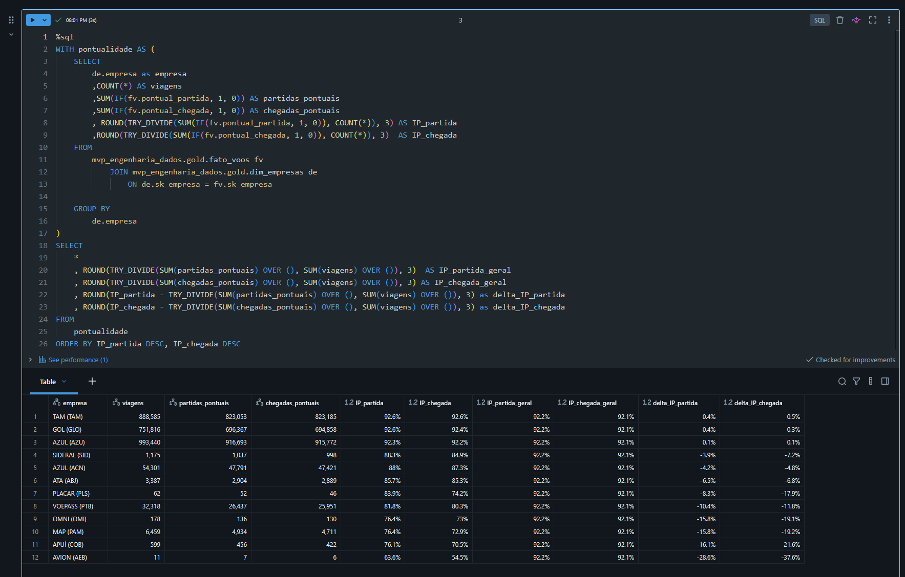
> Exemplo de consulta executada.

*OBS: Índice de pontualidade (I.P.): `Número de Voos pontuais na [etapa] / Número total de voos Realizados`*

### 6.1 Qual o I.P. de partida e chegada, por companhia, em todo o período? Como cada uma se compara à média geral?

#### Ranking de Índice de Pontualidade em todo o período (Jan 2023 a Jul 2026)

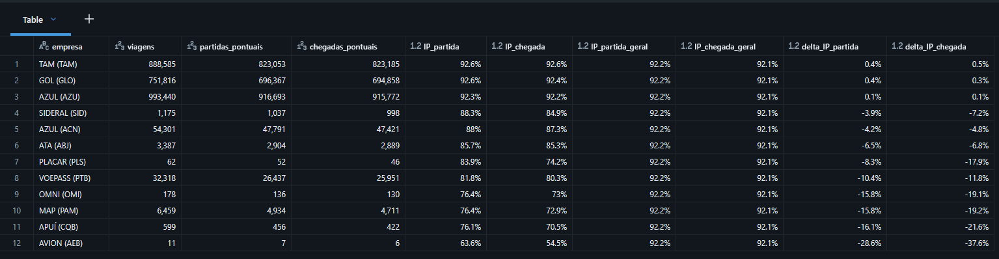

> TAM (Ou Latam como é seu nome comercial) tem o melhor Índice de Pontualidade tanto de partidas com `92.6%` quanto de chegadas com também `92.6%`.

> A média geral de partidas é de `92.2%`, enquanto que a de chegadas é de `92.1%`.

### 6.2 Qual o I.P. de partida e chegada, por companhia, ano a ano (incluindo o ano incompleto de 2026)? Existe alguma piora ou melhora nesses índices?

#### Pontualidade por Empresas Ano a Ano (Partida)

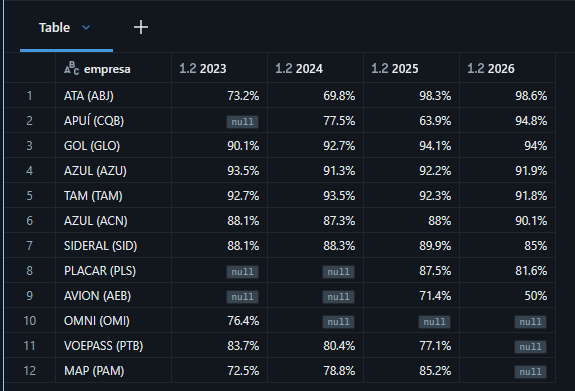

> É possível notar que algumas empresas tiveram melhora expressiva ao longo dos anos, **ATA** por exemplo estava com apenas `73.2%` em 2023 e agora em 2026 encontra-se com `98.6%` de pontualidade de partida.

> Outras como APUÍ, AZUL (ACN) também tiveram melhora notável.

> Algumas se mantiveram estáveis com poucas oscilações, mas pouquíssimas tiveram uma piora muito expressiva.

#### Pontualidade por Empresas Ano a Ano (Chegada)

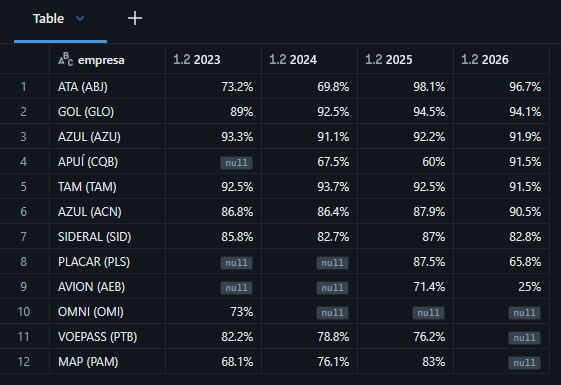

> Semelhante à evolução na pontualidade de partida, a de chegada mantém posições parecidas no geral, ou seja a tendência da pontualidade de partida é acompanhada pela de chegada.

### 6.3 Qual o I.P. de partida e chegada por Rota? Quais são as 10 melhores e 10 piores?

#### Antes de executar essa análise vamos definir um piso mínimo de quantidade de viagens.
Usaremos um intervalo de confiança com os seguintes parâmetros:

`z = 1.96` - 95% de confiança.

`p = 0.922` - 92.2% é a taxa média geral de pontualidade na base.

 `e = 0.03` - A margem de erro fica em 3 pontos percentuais.

> Com o resultado do cálculo obtemos um N mínimo de **307 amostras**.

#### 10 Rotas com **Melhor** Pontualidade de partida.

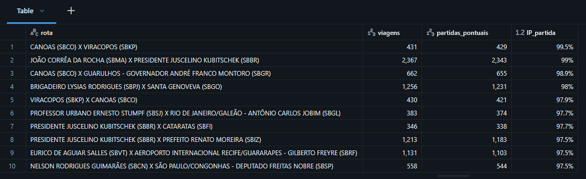

> Canoas X Viracopos aparece como a melhor rota em termos de pontualidade. As rotas no topo tem um desempenho semelhante entre si.

#### 10 Rotas com **Pior** Pontualidade de partida.

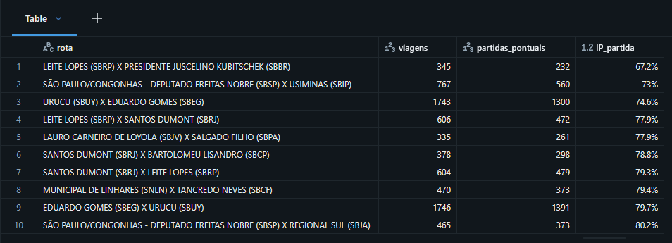

> Leite Lopes X Presidente Juscelino tem o pior desempenho em pontualidade, e se descola dos demais. Mesmo nesse ranking, o "melhor dos piores" ainda atinge 80%.

#### 10 Rotas com **Melhor** Pontualidade de Chegada.

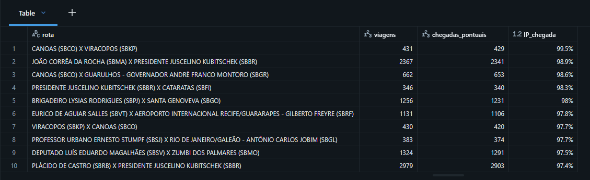

> A Pontualidade de Chegada segue praticamente a mesma tendência das rotas por partida.

#### 10 Rotas com **Pior** Pontualidade de Chegada.

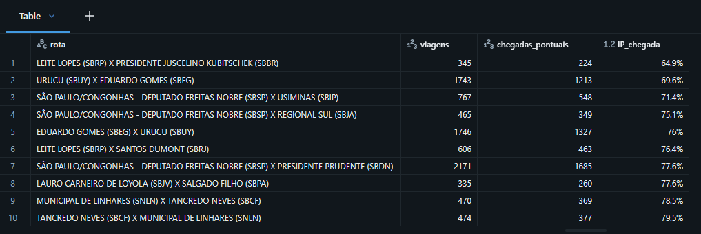

> Nos piores por chegada, a mesma rota ganha de novo, indicando que o desempenho tanto de partidas quanto de chegadas são bastante conectados.

### 6.4 Qual o I.P de partida e chegada por Aeroporto? Quais são os 10 melhores e os 10 piores?

#### Usaremos o mesmo intervalo de confiança definido anteriormente: 307 amostras mínimas.

#### Pontualidade de Partida por Aeroporto (10 Melhores)

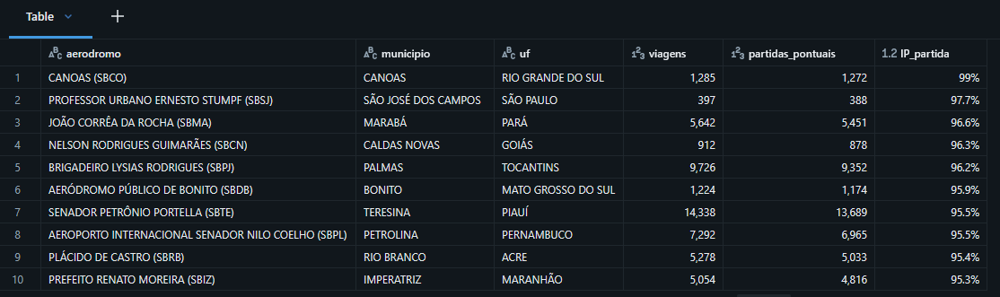

> Canoas aparece como o melhor aeroporto em termos de pontualidade de partida. Nesse ranking, os aeroportos que ficaram no topo são de pequeno ou médio porte.

#### Pontualidade de Partida por Aeroporto (10 Piores)

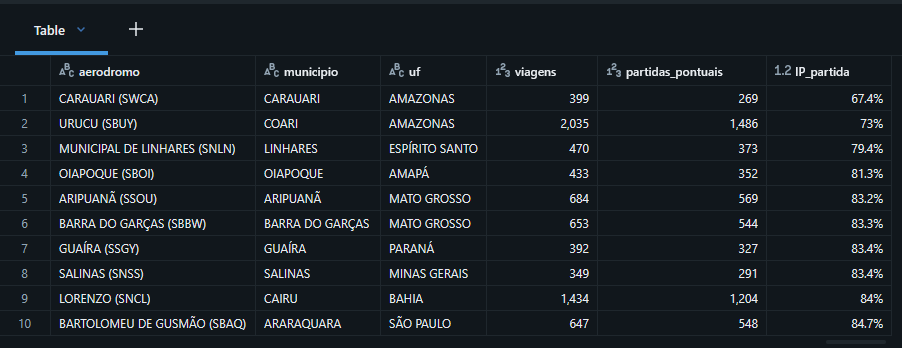

> O ranking dos piores aeroportos por pontualidade de partida é dominado por aeródromos menores

#### Pontualidade de Chegada por Aeroporto (10 Melhores)

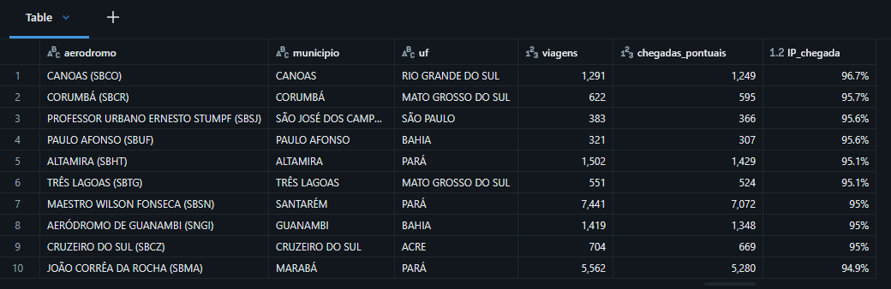

> Novamente seguindo a tendência da pontualidade de partida acompanhar a de chegada, praticamente os mesmos do ranking de partida aparecem no de chegada.

#### Pontualidade de Chegada por Aeroporto (10 Piores)

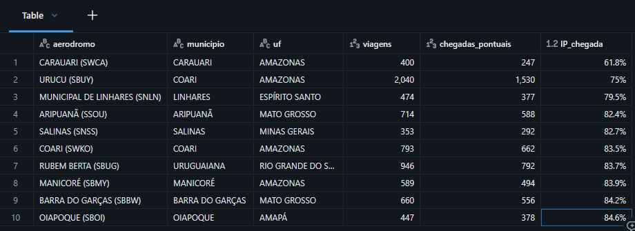

> E o mesmo ocorre com os piores.

### 6.5 Como é o I.P de partida e chegada por mês? Existe algum ciclo ou sazonalidade?

#### I.P. por Mês (Tendência e Sazonalidade)

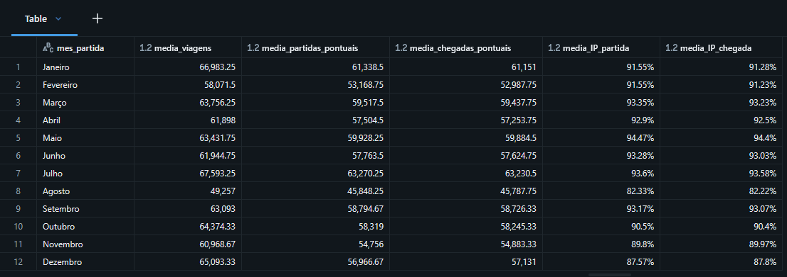

> Existe uma certa estabilidade ao longo do ano, com uma queda abrupta em Agosto, o número se estabiliza novamente para depois voltar a cair em novembro e dezembro.
> Tanto I.P. Partida quanto de Chegada seguem a mesma tendência.
> O Melhor mês é o de Maio, e o pior é o de Agosto.

### 6.6 Como é o I.P de partida e chegada por dia da semana? Existe alguma tendência?

#### Pontualidade de Partida e Chegada por dia da Semana da Partida

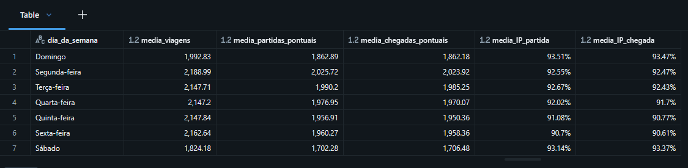

> Há uma queda na pontualidade especificamente entre Quinta-feira e Sexta-feira, o que parece indicar um aumento na demanda.

### 6.7 Como é o I.P de partida e chegada por horário de partida do voo? Horários com mais partidas ou chegadas têm mais atrasos?

#### Pontualidade por Faixa de Horário

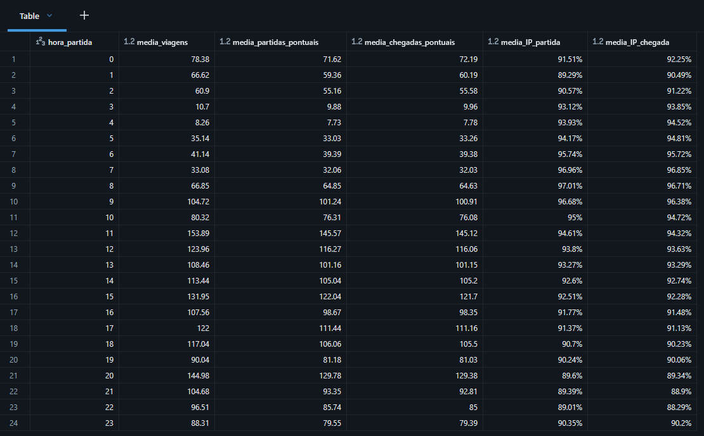

> A pontualidade é melhor pela manhã até entre 5h e 11h, e declina aos poucos ao longo do dia até atingir seus piores índices à noite na faixa de 20h - 22h.

> Sobre horários com mais viagens terem pior desempenho, não existe uma relação muito clara. O resultado da correlação foi de `-30.54%`

### 6.8 Qual é a média de tempo de atraso de partida e de chegada, por Companhia?

#### Média de tempo de atraso por empresa (Em minutos)

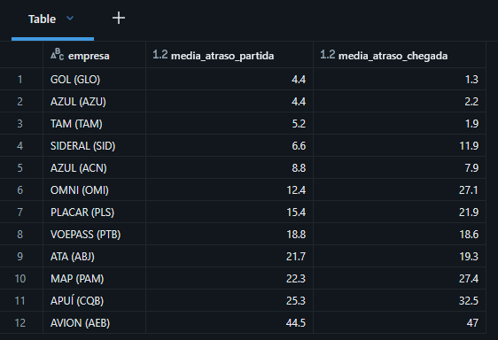

> GOL tem o melhor tempo de atraso, com uma média de 4.4 min na partida e 1.3 min na chegada.

> No geral as 3 grandes (GOL, AZUL, LATAM) ficam com desempenho muito próximo.

### 6.9 Qual é a média de tempo de atraso de partida e de chegada, por Rota?

#### Novamente para os casos abaixo utilizaremos um limiar também customizado

Para média de atraso, utilizamos `z = 1.96`, `σ = 27.89` (desvio padrão do atraso de partida), e `e = 5` (margem de 5 minutos). O N mínimo calculado é de **120 amostras**.

#### Média de Atraso na Partida por Rota (10 melhores)

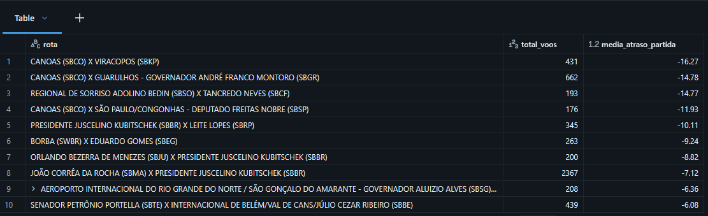

> As mesmas rotas que têm um índice bom de pontualidade também aparecem com menor tempo de atraso. E nesse caso o Top 10 ficou com uma média negativa, ou seja, tendem a antecipar.

#### Média de Atraso na Partida por Rota (10 piores)

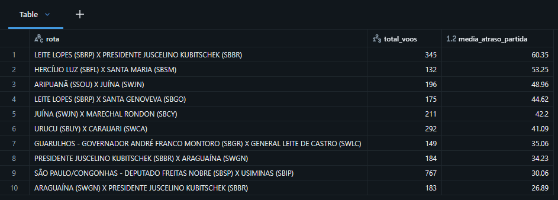

> Como era esperado, as rotas que têm pontualidade ruim também terão desempenho ruim na média de atraso. A rota Leite Lopes X Brasília lidera com +60,35 minutos de atraso médio na partida.

#### Média de Atraso na Chegada por Rota (10 Melhores)

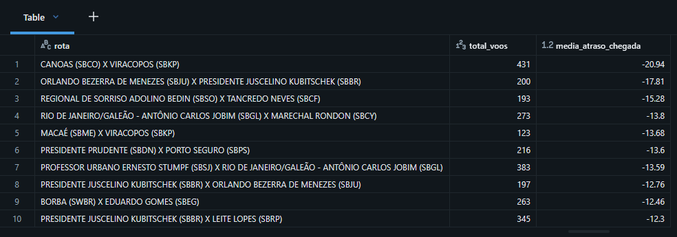

> Assim como na partida, as 10 rotas com melhor desempenho de chegada também apresentam média negativa (adiantamento), com destaque para Canoas X Viracopos (-20,94 min) e Orlando Bezerra X Brasília (-17,81 min).

#### Média de Atraso na Chegada por Rota (10 Piores)

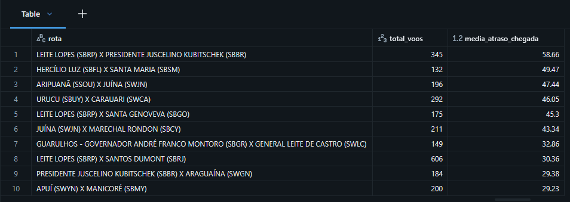

> O ranking de piores por chegada espelha o de partida, com Leite Lopes X Brasília novamente liderando com +58,66 minutos. As mesmas rotas que aparecem ruins na partida também são ruins na chegada, confirmando a forte conexão entre os dois indicadores.

### 6.10 Qual é a média de tempo de atraso de partida e de chegada, por Aeroporto?

#### Média de Atraso de Partida por Aeroporto (10 melhores)

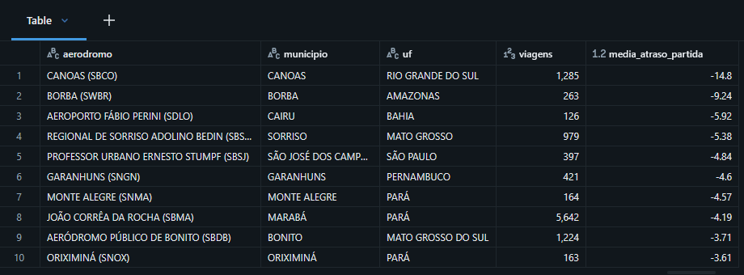

> Canoas (RS) lidera novamente com -14,8 minutos de atraso médio na partida, seguido por Borba (AM) com -9,24 min. Os aeroportos no topo são de pequeno e médio porte em regiões Sul, Norte e Centro-Oeste.

#### Média de atraso de Partida por Aeroporto (10 piores)

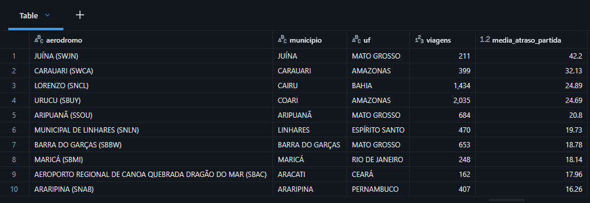

> Os piores atrasos de partida se concentram em aeródromos da Amazônia (Juína +42,2 min, Carauari +32,13 min, Urucu +24,69 min) e locais remotos. Todos os 10 piores têm atraso médio acima de 16 minutos.

#### Média de Atraso de Chegada por Aeroporto (10 Melhores)

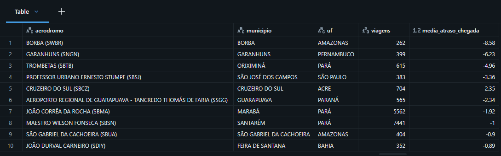

> O ranking de chegada apresenta aeroportos diferentes do de partida, com Borba (AM) assumindo a primeira posição (-8,58 min), seguido por Garanhuns (PE) e Trombetas (PA). Todos os 10 melhores têm atraso médio negativo na chegada.

#### Média de Atraso de Chegada por Aeroporto (10 Piores)

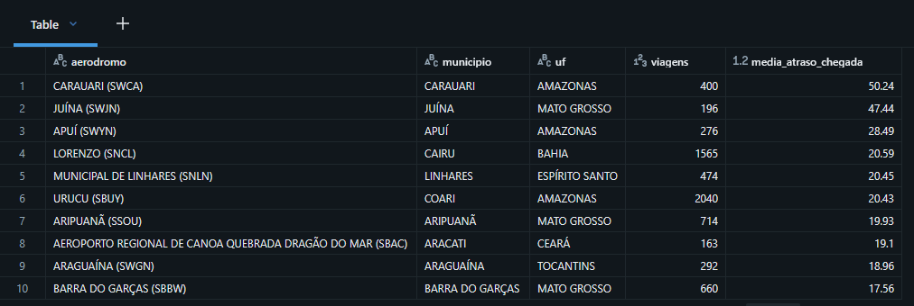

> Carauari (AM) aparece como o pior aeroporto em ambas as dimensões, com atraso médio de chegada de +50,24 minutos. Os piores aeroportos são majoritariamente da região Amazônica (Carauari, Juína, Aripuanã, Urucu), confirmando o padrão geográfico observado na análise de pontualidade.

> As análises de tempo de atraso demonstram que esse indicador está totalmente conectado ao índice de pontualidade. O ranking fica muito semelhante entre os dois indicadores.

### 6.11 Discussão Geral

A análise das 10 perguntas apresenta um panorama da pontualidade do transporte aéreo doméstico de passageiros no Brasil entre janeiro de 2023 e julho de 2026. O Índice de Pontualidade (I.P.) geral foi de **92,2% na partida** e **92,1% na chegada**, considerando os critérios adotados pela ANAC.

**Diferenças entre companhias.** As três maiores operadoras, TAM, GOL e AZUL, apresentaram índices de pontualidade elevados e atrasos médios de aproximadamente 4 a 5 minutos na partida. Entre as companhias de menor porte, AVION, APUÍ, MAP e ATA apresentaram os menores indicadores em parte dos períodos analisados, com atrasos médios de até 44 minutos no caso da AVION. Também foram observadas mudanças relevantes ao longo do tempo. A ATA, por exemplo, passou de 73,2% de pontualidade em 2023 para 98,6% em 2026. Os dados mostram, portanto, diferenças entre as empresas e variações ao longo do período analisado.

**Distribuição geográfica.** Os menores índices de pontualidade e os maiores atrasos médios aparecem com frequência em aeródromos da região Amazônica e em localidades mais remotas, como Carauari, Juína, Urucu, Aripuanã e Barra do Garças. Carauari apresentou os maiores atrasos médios entre os aeródromos analisados, com +32,13 minutos na partida e +50,24 minutos na chegada. No outro extremo, Canoas apresentou I.P. próximo de 99% e atraso médio de -14,8 minutos na partida. Entre as rotas, destacam-se também operações com baixo volume de voos e desempenho inferior, como a ligação entre Leite Lopes, em Ribeirão Preto, e Presidente Juscelino Kubitschek, em Brasília, que apresentou I.P. de 67,2% na partida e 64,9% na chegada, além de atrasos médios superiores a 58 minutos.

**Variação ao longo do tempo.** A pontualidade apresentou diferenças importantes entre os meses. Maio registrou o maior I.P., com 94,47%, enquanto agosto apresentou 82,33%. Também houve redução nos meses de novembro e dezembro. Na comparação por dia da semana, sábado e domingo apresentaram os maiores índices, próximos de 93%, enquanto quinta e sexta ficaram próximos de 91%. Ao longo do dia, os melhores resultados ocorreram entre 5h e 11h, com I.P. superior a 94%, enquanto os menores foram observados entre 20h e 22h, próximos de 89%. A correlação entre volume de voos e pontualidade foi de -30,54%, indicando uma associação negativa de magnitude moderada a fraca entre as duas variáveis.

**Relação entre pontualidade e atraso médio.** Os resultados das perguntas 8 a 10 seguem padrão semelhante aos observados nas análises de I.P. As rotas e os aeródromos que apresentam melhores índices de pontualidade também tendem a apresentar menores atrasos médios, enquanto os piores resultados aparecem em ambos os indicadores. Esse comportamento reforça a consistência entre as duas formas de medir o desempenho operacional. Também foi observada relação entre os atrasos na partida e na chegada, indicando que atrasos na saída frequentemente permanecem ou aumentam ao longo da operação.

**Síntese dos resultados.** Os resultados mostram diferenças de pontualidade associadas a companhia aérea, localização do aeródromo e período da operação. As maiores diferenças aparecem entre companhias de portes distintos, entre aeródromos com características operacionais diferentes e entre horários e períodos do ano. Os menores índices estão concentrados principalmente em algumas operações regionais e em determinados aeródromos e faixas de horário. A base analisada permite identificar esses padrões, mas não permite determinar, isoladamente, as causas dos atrasos observados.

## 7. Autoavaliação

### 7.1 Atingimento dos Objetivos

O objetivo geral deste trabalho foi utilizar dados públicos da ANAC para analisar a pontualidade das operações aéreas domésticas de passageiros no Brasil. Esse objetivo foi alcançado. As 10 perguntas apresentadas na Seção 1.2 foram respondidas por meio de consultas SQL aplicadas a uma base tratada com 2.732.331 voos realizados entre janeiro de 2023 e julho de 2026.

As perguntas foram analisadas em três dimensões: companhia aérea, localização e tempo. A análise conjunta permitiu observar diferenças de pontualidade associadas ao porte das companhias, à localização dos aeródromos e aos horários das operações. Esses resultados foram reunidos na discussão geral da Seção 6.11.

Algumas limitações afetaram o alcance da análise.

- **Ausência do campo Justificativa:** a ANAC deixou de exigir esse campo a partir de abril de 2020, conforme apresentado na Seção 1.4. Com isso, foi possível medir a ocorrência e a duração dos atrasos, mas não identificar diretamente suas causas. Os resultados observados na Amazônia, por exemplo, permitem levantar hipóteses relacionadas à infraestrutura, às características das rotas e às condições meteorológicas, mas essas relações não podem ser confirmadas com os dados utilizados.

- **Recorte temporal:** os dados analisados vão até julho de 2026, último mês disponível na coleta. O período cobre cerca de três anos e meio, mas não contempla outros ciclos relevantes do setor, como os anos de 2020 e 2021.

### 7.2 Dificuldades Encontradas

#### Dificuldades técnicas

- **Dados ausentes nas fontes oficiais:** Voepass (PTB) e MAP (PAM) não estavam presentes no cadastro do SIROS, embora seus voos aparecessem na base VRA. Foi necessário incluir manualmente essas empresas. Também foram encontrados 28 códigos OACI de aeródromos presentes na VRA e ausentes na dimensão de aeródromos, exigindo complementação manual.

- **Deslocamento de data:** 660 partidas e 665 chegadas apresentavam horário correto, mas estavam associadas ao dia errado. O problema foi identificado pela concentração anormal de atrasos entre 12 e 24 horas. A correção envolveu o recálculo da data, do atraso e da situação do voo, conforme descrito na Seção 5.3.

- **Padronização entre fontes:** ANAC e SIROS utilizam formatos diferentes para algumas variáveis. Foi necessário padronizar os valores de UF para nomes por extenso e converter o campo de altitude para o formato decimal utilizado na camada silver.

- **Documentação incompleta:** alguns campos diferem de sua documentação ou não estão presentes nela. Algumas fontes de dados demandaram bastante tempo de pesquisa e verificação antes de poderem ser utilizadas.

#### Dificuldades analíticas

- **Definição do piso amostral:** para os rankings das questões 3 a 10, foi necessário estabelecer um número mínimo de voos para evitar resultados influenciados por amostras muito pequenas. Para proporções, foi utilizado intervalo de confiança com z=1,96, p=0,922 e erro de 0,03, resultando em N mínimo de 307. Para atraso médio, foi utilizado σ=27,89 e erro de 5 minutos, resultando em N mínimo de 120.

- **Relação entre volume e pontualidade (Q7):** a hipótese inicial era de que horários com maior número de partidas apresentariam mais atrasos. A correlação observada foi de -30,54%, indicando uma relação fraca e exigindo uma interpretação diferente da hipótese inicial.

### 7.3 Trabalhos Futuros

#### Extensões de escopo

- **Complementação dos dados:** Complementar a análise com mais fontes externas, como por exemplo de meteorologia, distâncias de trajetos, ou até mesmo mais fontes da própria ANAC, como modelos de aeronave, que estão disponíveis mas não foram explorados.

- **Inclusão de voos internacionais:** a comparação com operações internacionais poderia indicar quais padrões observados são específicos do mercado doméstico e quais também aparecem em outras operações.

#### Extensões técnicas

- **Automatização da ingestão:** a coleta dos arquivos da ANAC ainda depende da execução do notebook 02. Um job agendado poderia buscar novos arquivos mensalmente, comparar com os dados já existentes e atualizar as camadas bronze, silver e gold de maneira automática.

- **Atualização do pipeline para reestruturação:** Garantir que o pipeline possa ser executado novamente do zero, resultando sempre no mesmo resultado.

- **Dashboard sobre a camada Gold e tabelas agregadas:** as análises estão atualmente concentradas no notebook SQL. Um dashboard conectado às tabelas gold permitiria explorar os resultados por companhia, rota, aeródromo e período de forma interativa.

